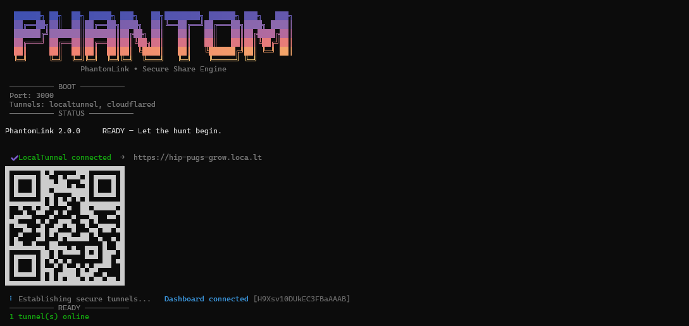
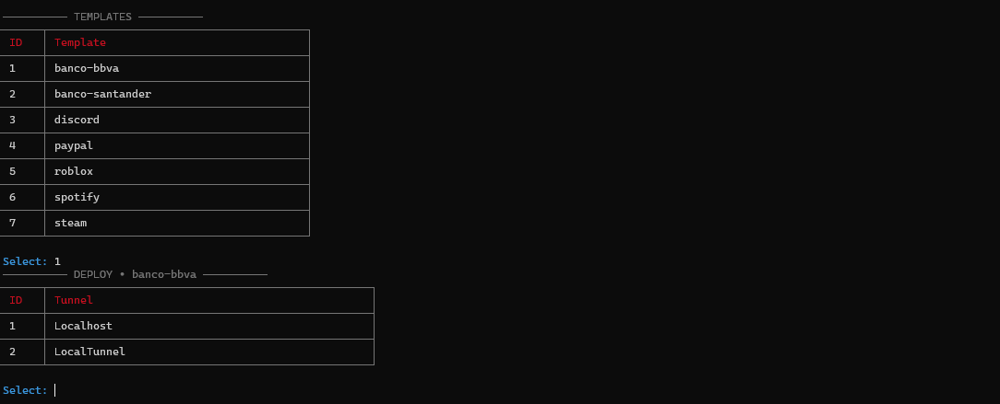
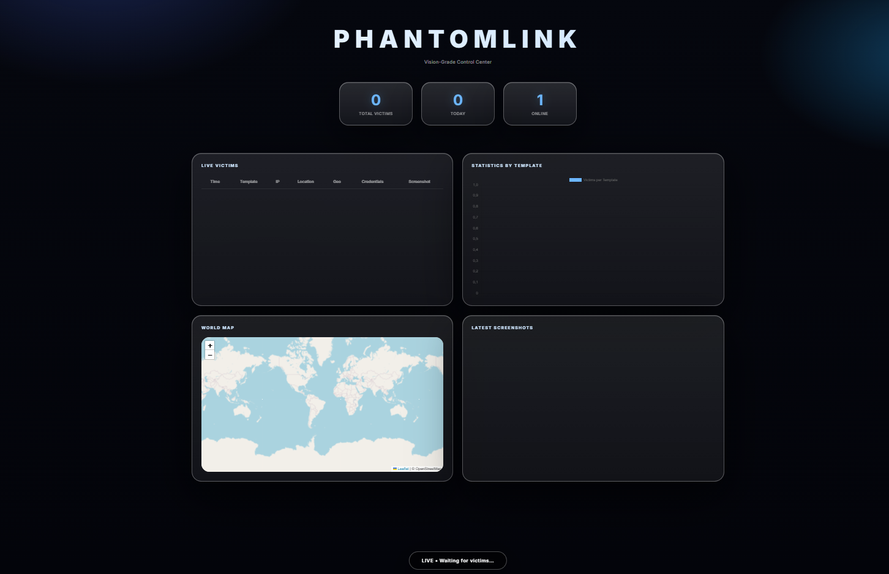
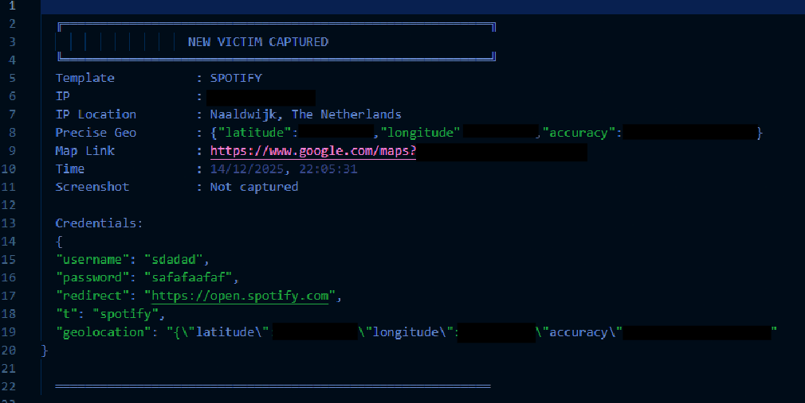

# PhantomLink

PhantomLink is a state-of-the-art, modular framework for simulating phishing attacks, developed exclusively for educational, research, and authorized penetration testing purposes. Constructed entirely in pure Node.js, it offers a sophisticated platform for designing, deploying, and monitoring phishing campaigns with exceptional precision and stealth. Drawing inspiration from established tools like Zphisher, PhantomLink advances the field with a highly polished command-line interface, real-time monitoring dashboard, and advanced features including geolocation capture, screenshot acquisition, and secure tunneling mechanisms.
This framework emphasizes ethical use and compliance with legal standards, providing security professionals and researchers with a powerful tool to demonstrate vulnerabilities and enhance defensive strategies.

--- 

## Overview

In an era where phishing attacks remain a predominant threat vector—accounting for over 90% of successful cyberattacks according to recent cybersecurity reports—PhantomLink serves as an indispensable resource for red team operations and security awareness initiatives. The framework is engineered to replicate real-world phishing scenarios with high fidelity, enabling users to assess organizational resilience against social engineering tactics.
Key differentiators include its modular architecture, which allows for seamless extension and customization, and its focus on stealth, ensuring that simulations evade common detection methods. PhantomLink is not merely a tool but a comprehensive ecosystem that integrates capture, analysis, and reporting in a unified, efficient workflow.

--- 

## Key Features

PhantomLink incorporates a suite of advanced capabilities tailored for professional use. The following table outlines its primary features and their practical applications:

| Feature Category | Description | Applications |
| --- | --- | --- |
| Template Management | Supports over 10 templates replicating popular platforms such as Netflix, Roblox, Spotify, Steam, PayPal, BBVA, Santander, and more. Templates are updated to reflect December 2025 designs for maximum realism. | Simulate targeted phishing campaigns; test user awareness across diverse services. |
| Real-Time Monitoring Dashboard | A glassmorphism-styled dark theme interface with visual effects, live victim tables, interactive world maps (powered by Leaflet), statistics charts (powered by Chart.js), and screenshot galleries. The dashboard is secured with password authentication. | Monitor ongoing simulations; analyze victim interactions in real time; visualize geolocation data for strategic insights. |
| Stealth Capture Mechanisms | Precise geolocation acquisition (latitude, longitude, accuracy) and full-page screenshot capture using HTML2Canvas. Supports JPEG compression to minimize detection risks and ensure compatibility with tunneling protocols. | Gather contextual data without alerting the target; enhance simulation authenticity while maintaining low visibility. |
| Secure Tunneling System | Automatic deployment with LocalTunnel (loca.lt), Cloudflared (trycloudflare.com), and Localhost for testing. Features QR code generation for easy link sharing and auto-rotation for reliability. | Deploy simulations securely and anonymously; bypass network restrictions in controlled environments. |
| Notification Integration | Instant alerts to Discord or Telegram webhooks, including credentials, IP addresses, map links, timestamps, and screenshots. | Receive immediate feedback on campaign progress; integrate with existing security operations centers. |
| Advanced Evasion Techniques | User-Agent rotation, header spoofing, fingerprint obfuscation, and dynamic fake responses (404/503) for suspicious paths. Basic bypass for Cloudflare Turnstile and hCaptcha. | Evade automated detection systems; conduct simulations in high-security environments. |
| Command-Line Interface | Professional CLI with gradient headers, spinner animations, interactive tables for template and tunnel selection, and colorful output for enhanced user experience. | Facilitate quick deployment and management; streamline workflow for experienced users. |
| Developer Extensibility | Modular design with easy integration of custom modules, helpers for random string generation and UA parsing, and support for Docker deployment. | Customize for specific use cases; scale for enterprise-level simulations. |

--- 

## Screenshots

---

### Command-Line Interface

<p align="center">
  <em>Interactive command-line interface featuring gradient headers and table-based selection for templates and tunneling methods.</em>
</p>

<table align="center">
  <tr>
    <td align="center">
      
    </td>
    <td align="center">
      
    </td>
  </tr>
</table>

---

### Admin Dashboard

<p align="center">
  <em>Real-time administrative dashboard with live tables, geolocation mapping, analytics, and screenshot previews.</em>
</p>

<p align="center">
  
</p>

---

### Capture Log

<p align="center">
  <em>Detailed capture log presenting credential records, IP metadata, precise geolocation data, and captured screenshots.</em>
</p>

<p align="center">
  
</p>

---

## Installation

- Operating System: Windows, macOS, or Linux
- Node.js: Version 22 or higher (LTS recommended for stability)
- Memory: Minimum 2GB RAM for basic operations; 4GB+ for advanced simulations with multiple tunnels
- Storage: 500MB+ for templates, captures, and dependencies
- Network: Stable internet connection for tunneling and external API calls (e.g., IP geolocation)

## Step-by-Step Installation

1. Clone the Repository
Obtain the source code from GitHub:

```bash
git clone https://github.com/0xlayout/phantomlink.git
cd phantomlink
```

2. Install Dependencies
Use npm to install all required packages:

```bash
npm install
```
This installs core libraries such as Express, Socket.IO, html2canvas, picocolors, gradient-string, cli-table3, and qrcode-terminal, etc.

3. Configure the Framework
Edit `config/config.json` to customize settings. A sample configuration is provided:

```json
{
  "server": {
    "port": 3000,
    "host": "0.0.0.0"
  },
  "tunnels": {
    "enabled": ["localtunnel", "cloudflared"],
    "localtunnelSubdomain": "phantomlink",
    "autoRotate": true
  },
  "notifications": {
    "webhookUrl": "your-discord-or-telegram-webhook",
    "qrInTerminal": true
  },
  "stealth": {
    "fakeUserAgent": true,
    "blockScanners": true
  },
  "https": {
    "enabled": false
  },
  "admin": {
    "enabled": true,
    "password": "password-secure"
  }
}
```

4. Launch the Framework
Start the server in development mode:

```bash
npm run dev
```
The CLI will guide you through template and tunnel selection, generating shareable links.

## Usage

### Command-Line Interface Workflow
Upon launching, the CLI presents an intuitive, aesthetic interface:

1. Template Selection
Choose from the available templates using the numbered table. Templates are dynamically loaded from the templates/ directory.
2. Tunnel Selection
Select a deployment tunnel (Localhost for testing, LocalTunnel or Cloudflared for production). The tool automatically detects and lists active tunnels.
3. Link Generation
The final phishing link is generated, complete with a QR code for easy sharing. The link is fully functional with injected stealth capture scripts.

### Admin Dashboard Access

Navigate to `http://localhost:3000/dashboard` (or the equivalent tunnel URL). Upon first access, enter the admin credentials defined in config.json. The dashboard provides comprehensive monitoring capabilities, including live updates via Socket.IO.

### Customizing Templates
To add or modify templates:

- Create a new directory in templates/ (e.g., templates/custom-service/).
- Place an index.html file with a form targeting /capture?t=custom-service.
- The framework automatically injects geolocation and screenshot capture scripts, ensuring compatibility and stealth.

### Integration with Webhooks

Configure webhook URLs in `config.json` for immediate notifications. Supported platforms include Discord and Telegram, with formatted messages containing all captured data.

## Project Structure
The framework is organized for modularity and ease of extension:

```text
PhantomLink/
├── templates/               # Templates (e.g., discord/index.html)
├── captures/                # Stored logs, screenshots, and data
├── public/                  # Dashboard HTML and static assets
├── src/
│   ├── core/                # Core engine 
│   ├── routes/              # API routes 
│   └── utils/               # Utility functions
├── config/
│   └── config.json          # Central configuration file
├── LICENSE                  # MIT License file
├── README                   # Readme
└── package.json            
```

## Legal and Ethical Considerations

PhantomLink is provided solely for legitimate security testing and educational purposes. It is not intended for malicious use, and any such application is strictly prohibited. Users must obtain explicit permission from all parties involved before conducting simulations.
The developers disclaim all liability for any damages or legal consequences arising from misuse. Compliance with local laws, regulations, and ethical standards is the responsibility of the user.

## Contributing
We encourage contributions from the security community to enhance PhantomLink. To contribute:

1. Fork the repository.
2. Create a feature branch (git checkout -b feature/YourFeature).
3. Commit your changes (git commit -m "Add YourFeature").
4. Push to the branch (git push origin feature/YourFeature).
5. Open a Pull Request, detailing the changes and their benefits.
Please adhere to the code of conduct and ensure all submissions are original and licensed under MIT.

## License

PhantomLink is released under the MIT License. See the LICENSE file for full details.
Copyright © 2026 0xlayout. All rights reserved.
